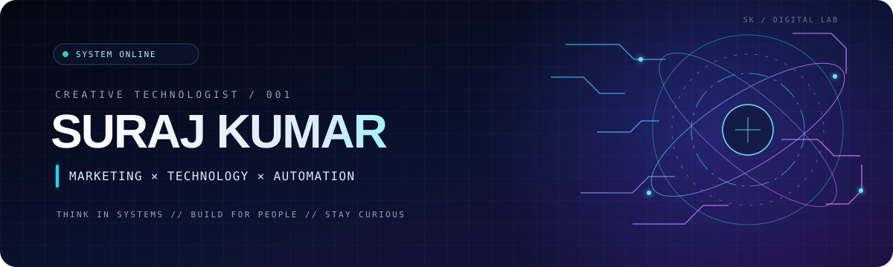
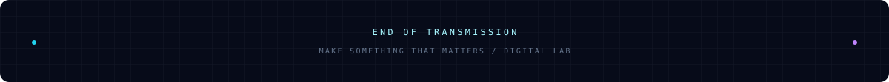

<div align="center">



<br/>

[](https://github.com/thesurajdev)
[](https://github.com/thesurajdev?tab=repositories)
[](https://github.com/thesurajdev?tab=repositories)

### I build where **creative thinking meets measurable growth.**

*Digital marketing · Web experiences · Automation · Product thinking*

[EXPLORE BUILDS](https://github.com/thesurajdev?tab=repositories)　 **///**　 [CONNECT](https://www.instagram.com/thesurajdev/)　 **///**　 [PORTFOLIO](https://thesurajdev.github.io/)

</div>

---

<table>
<tr>
<td width="58%" valign="top">

## `01 // THE OPERATOR`

I'm Suraj — a digital marketer and creative technologist interested in the space between **how people discover things and how technology makes them work**.

I bring a growth mindset to building: understand the audience, solve the real problem, make the experience intuitive, and measure what improves.

</td>
<td width="42%" valign="top">

### `SYSTEM PROFILE`

```yaml
identity: Suraj Kumar
handle: thesurajdev
mode: Creative Technologist
core_loop: Think -> Build -> Measure -> Refine
focus:
  - Growth systems
  - Web products
  - Workflow automation
```

</td>
</tr>
</table>

## `02 // CAPABILITY GRID`

<table>
<tr>
<td width="50%" valign="top">

###  GROWTH ENGINE

Technical SEO · Search strategy · Content architecture · Performance marketing · Analytics · Conversion optimization

</td>
<td width="50%" valign="top">

###  DIGITAL ENGINEERING

WordPress · Next.js · React · Tailwind CSS · JavaScript · APIs · Responsive web experiences

</td>
</tr>
<tr>
<td width="50%" valign="top">

###  AUTOMATION LAYER

Workflow automation · Webhooks · Google Sheets · n8n · Integrations · AI-assisted workflows

</td>
<td width="50%" valign="top">

###  PRODUCT THINKING

Digital products · Rapid experiments · User-focused design · Systems thinking · Iteration

</td>
</tr>
</table>

<div align="center">


</div>

## `03 // SELECTED MISSIONS`

<table>
<tr>
<td width="50%" valign="top">

<a href="https://thesurajdev.github.io/color-my-art/"></a>

**A playful digital canvas.**

A creative web experience from the Born To Banger ecosystem, built around accessible, interactive art.

[OPEN PROJECT ↗](https://thesurajdev.github.io/color-my-art/)

</td>
<td width="50%" valign="top">

<a href="https://borntobanger.in/"></a>

**Ideas into real-world experiences.**

An events and activities brand connecting people with artists, workshops, and memorable experiences.

[EXPLORE BTB ↗](https://borntobanger.in/)

</td>
</tr>
<tr>
<td width="50%" valign="top">

<a href="https://github.com/thesurajdev/GMB-Data-Scraper"></a>

**Structured local-search research.**

A repository focused on Google Business Profile data collection and local-search workflows.

[VIEW REPOSITORY ↗](https://github.com/thesurajdev/GMB-Data-Scraper)

</td>
<td width="50%" valign="top">

<a href="https://github.com/thesurajdev/AI-Memory-MCP"></a>

**Exploring connected AI systems.**

A project exploring memory and context infrastructure for AI-powered workflows.

[VIEW REPOSITORY ↗](https://github.com/thesurajdev/AI-Memory-MCP)

</td>
</tr>
</table>

<div align="center">

[](https://github.com/thesurajdev?tab=repositories)

</div>

## `04 // BUILD TELEMETRY`

<div align="center">


</div>

<sub><b>Telemetry note:</b> These cards are served by external services and may occasionally be unavailable or take time to refresh.</sub>

## `05 // PRIME DIRECTIVE`

> **Make it useful. Make it discoverable. Make it better.**

I believe the strongest digital experiences combine creative direction, sound engineering, and measurable outcomes. The goal is not to add more technology; it is to remove friction between a good idea and the person it is meant to help.

## `06 // OPEN CHANNEL`

Have a challenge involving digital growth, a website, automation, or a new product idea? Let's connect the dots and build something meaningful.

<div align="center">

[](https://github.com/thesurajdev?tab=repositories)
[](https://www.instagram.com/thesurajdev/)
[](https://thesurajdev.github.io/)

<br/>



<sub>THINK IN SYSTEMS // BUILD FOR PEOPLE // STAY CURIOUS</sub>

</div>
