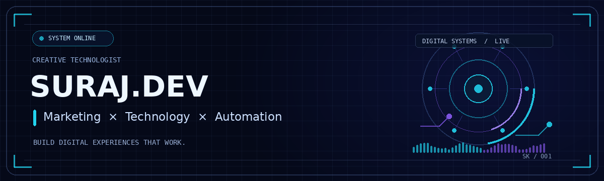
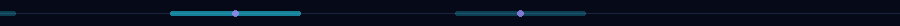

 

### Marketing · Web Development · Automation

I turn ideas into digital experiences that are useful, discoverable, and measurable.

## About me

Hi, I'm **Suraj Kumar** — a digital marketer and creative technologist. I combine audience-first marketing with practical web development and automation to help ideas become useful digital experiences.

I care about both sides of a product: **how people discover it and how well it works once they arrive.**

## What I do

<table>
<tr>
<td width="33%" valign="top">

### 📈 Digital growth

SEO, technical SEO, content strategy, paid campaigns, analytics, and conversion optimization.

</td>
<td width="33%" valign="top">

### 💻 Web experiences

WordPress, Next.js, React, responsive interfaces, website strategy, and API integrations.

</td>
<td width="33%" valign="top">

### ⚙️ Automation

Workflows, webhooks, Google Sheets, n8n, connected tools, and AI-assisted systems.

</td>
</tr>
</table>

## Tools & technologies

**Marketing:** SEO · Content Strategy · Performance Marketing · Analytics  
**Development:** WordPress · Next.js · React · Tailwind CSS · JavaScript · APIs  
**Automation:** n8n · Webhooks · Google Sheets · AI-assisted workflows

## Selected projects

<table>
<tr>
<td width="50%" valign="top">

### [AI Memory MCP](https://github.com/thesurajdev/AI-Memory-MCP)

Exploring AI-native memory and connected knowledge workflows.

[View project →](https://github.com/thesurajdev/AI-Memory-MCP)

</td>
<td width="50%" valign="top">

### [GMB Data Scraper](https://github.com/thesurajdev/GMB-Data-Scraper)

Tools for local-business research and data workflows.

[View project →](https://github.com/thesurajdev/GMB-Data-Scraper)

</td>
</tr>
<tr>
<td width="50%" valign="top">

### [Occasion Radar](https://github.com/thesurajdev/occasion-radar-extension)

A browser extension project focused on event and occasion discovery.

[View project →](https://github.com/thesurajdev/occasion-radar-extension)

</td>
<td width="50%" valign="top">

### [Color My Art](https://thesurajdev.github.io/color-my-art/)

An interactive creative experience for the Born To Banger ecosystem.

[Launch experience →](https://thesurajdev.github.io/color-my-art/)

</td>
</tr>
</table>

## GitHub activity

These cards are generated from public GitHub activity. If an external stats service is temporarily unavailable, your projects and profile links above will still work.

 

## How I build

- **Start with people:** understand the problem before choosing the tools.
- **Make it clear:** keep the experience understandable and easy to use.
- **Measure and improve:** learn from outcomes and keep iterating.

## Let's connect

Have an idea involving digital growth, a website, or automation? Let's talk.

**SURAJ.DEV** · Think in systems. Build for people. Stay curious.

